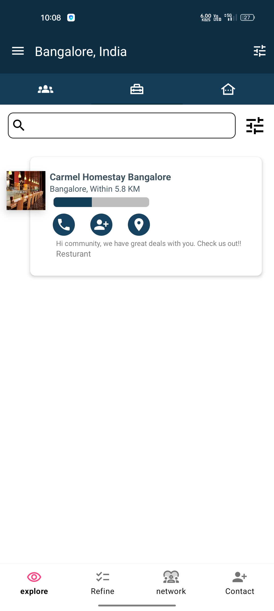
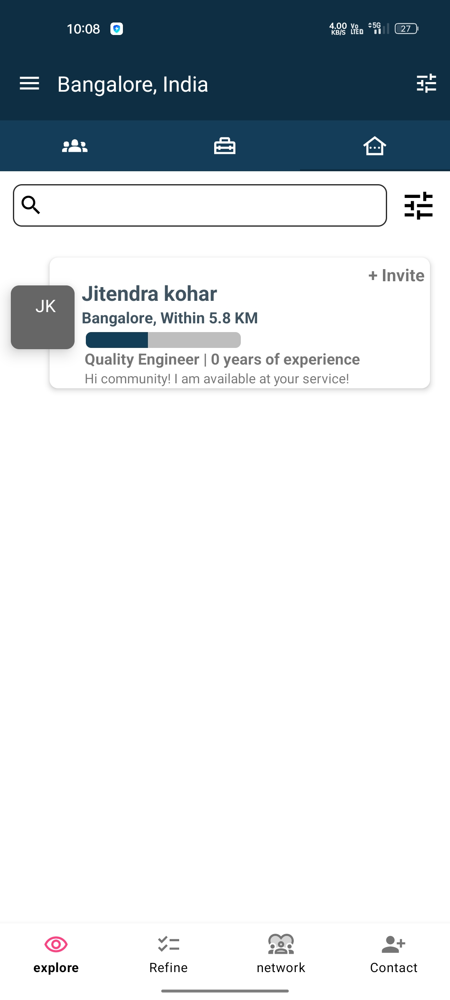
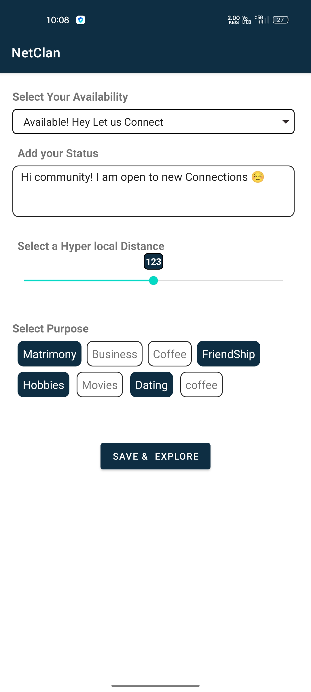

# netclan

# a netclan app interface
# My Awesome Project

Welcome to my awesome project! This is a brief overview of what this project is about.

## Introduction

This project is a user interface of the netclan .

## Screenshots

Here are some screenshots of the application:

##similar many more activity screen is there, Feel free to make any necessary changes

## Installation

To install the application, follow these steps:

1. Clone the repository.
2. Open the project in Android Studio.
3. Build and run the application on your device or emulator.

